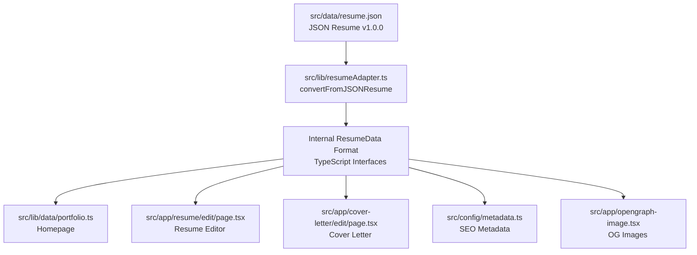

# CLAUDE.md

This file provides guidance to Claude Code (claude.ai/code) when working with code in this repository.

## 📖 Documentation Index

**Quick navigation to project documentation:**

| Document                                 | Purpose                      | Audience        |
| ---------------------------------------- | ---------------------------- | --------------- |
| **[QUICKSTART.md](./QUICKSTART.md)**     | Deploy in 10 minutes         | 👤 End Users    |
| **[ARCHITECTURE.md](./ARCHITECTURE.md)** | Complete technical deep-dive | 👨‍💻 Developers   |
| **[CONTRIBUTING.md](./CONTRIBUTING.md)** | Contribution guidelines      | 🤝 Contributors |
| **[CHANGELOG.md](./CHANGELOG.md)**       | Version history              | 📋 Everyone     |
| **[docs/](./docs/)**                     | Feature-specific guides      | 📖 All          |

**💡 For detailed technical architecture, see [ARCHITECTURE.md](./ARCHITECTURE.md)**

---

## 🎯 Critical Context for Claude Code

### The Golden Rules (Must Follow Always)

1. **Data-Driven Architecture:** All content flows from `src/data/resume.json` (JSON Resume v1.0.0 standard)
   - ✅ Edit JSON directly for content changes
   - ❌ Never modify components for content
   - Adapter automatically converts to internal format

2. **Type-Safe Development:** Three-step update pattern for new fields
   - Step 1: Define types in `src/types/resume.ts`
   - Step 2: Update adapter in `src/lib/resumeAdapter.ts`
   - Step 3: Update components to use new fields

3. **Always Test Before Deploy:** `npm test` must pass
   - GitHub Actions blocks deployment if tests fail
   - Run `npm test:coverage` to check threshold (85% minimum)
   - Never skip tests or disable coverage checks

4. **Dev Server as Foundation:** `npm run dev` must run continuously on port 3000
   - Force-kill conflicts: `kill -9 $(lsof -ti:3000)`
   - Hard reset with `.next/` deletion if files added/removed

### Quick File Reference (When Asked "Where Do I Edit?")

| What to Change                      | Primary File                     | How to Verify                                  |
| ----------------------------------- | -------------------------------- | ---------------------------------------------- |
| Portfolio content (name, role, bio) | `src/data/resume.json`           | Dev server → http://localhost:3000             |
| Homepage layout                     | `src/app/page.tsx`               | Dev server → http://localhost:3000             |
| Resume editor                       | `src/app/resume/edit/page.tsx`   | Dev server → http://localhost:3000/resume/edit |
| Component styling                   | `src/components/sections/*.tsx`  | Visual output on dev server                    |
| Password protection                 | `src/config/password.ts`         | Test at /resume/edit                           |
| AI generation prompts               | `src/lib/ai/document-prompts.ts` | Test in editor                                 |
| Data types                          | `src/types/resume.ts`            | `npx tsc --noEmit`                             |
| Adapter logic                       | `src/lib/resumeAdapter.ts`       | `npm test`                                     |

### Absolute Paths for Bash Commands

**⚠️ CRITICAL:** Claude Code agent threads reset working directory between bash calls.

- ✅ Use absolute: `/Users/aloshy/aloshy-ai/ismail-portfolio/src/...`
- ❌ Avoid relative: `./src/...` or `src/...` (may fail)

All file paths in this CLAUDE.md are relative from project root for documentation purposes only.

---

## 🤖 For Claude Code Agents

### Recommended Approaches

**Use Claude Code for:**

- ✅ Implementing features (code generation)
- ✅ Fixing bugs (targeted debugging)
- ✅ Adding tests (test generation)
- ✅ Refactoring specific files (isolated changes)
- ✅ Creating new components (file creation)
- ✅ Updating documentation (markdown edits)

**Escalate to Human Review for:**

- ⚠️ Architecture changes affecting 3+ modules
- ⚠️ Changes to `src/data/resume.json` structure (verify schema first)
- ⚠️ Breaking changes to public APIs
- ⚠️ Adding/removing npm dependencies
- ⚠️ Modifying build configuration (Next.js, TypeScript, Jest)

### Tool Usage Strategy

**Pattern 1: Understanding Existing Code**

```bash
# Question: "How does password protection work?"
# Strategy: Use Explore agent for cross-file analysis
Task tool with subagent_type=Explore, thoroughness="medium"
```

**Pattern 2: Adding Features with Tests**

```bash
# 1. Read type definitions: Read → src/types/resume.ts
# 2. Find related code: Grep → "resumeAdapter.ts"
# 3. Find examples: Glob → src/components/sections/*.tsx
# 4. Generate new component
# 5. Add test file
# 6. Verify: npm test -- path/to/component.test.tsx
```

**Pattern 3: Debugging Type Errors**

```bash
# 1. Build to see errors: npm run build
# 2. Identify error location
# 3. Read types: src/types/resume.ts
# 4. Check usage: Grep → "fieldName"
# 5. Fix order: types → adapter → components
```

---

## 🧭 Decision Trees: Common Scenarios

### Scenario 1: "I need to add a new field to the resume"

```
Is it a JSON Resume v1.0.0 standard field?
├─ YES → Edit `src/data/resume.json` only
│        └─ Adapter reads it automatically ✓
│
└─ NO → Is it custom data?
         ├─ YES → Follow this order:
         │        1. Add to `src/types/resume.ts` (define type)
         │        2. Update `src/lib/resumeAdapter.ts` (parse it)
         │        3. Update components (display it)
         │        4. Add tests (verify it)
         │
         └─ UNSURE → Check JSON Resume standard:
                     https://jsonresume.org/schema/
                     or see ARCHITECTURE.md (Data Adapter Pattern section)
```

### Scenario 2: "Tests are failing after my changes"

```
What type of failure?
├─ Type errors → Fix types first, then adapter, then components
│
├─ Component tests → Update snapshots or fix component logic
│
├─ Integration tests → Check data flow: JSON → adapter → component
│
└─ Coverage below 85% → Add missing test cases
```

### Scenario 3: "How do I add a new homepage section?"

```
Step 1: Add data to `src/data/resume.json`
   └─ Use JSON Resume standard format if possible

Step 2: Create component in `src/components/sections/`
   └─ Use PascalCase filename (e.g., NewSection.tsx)

Step 3: Update `src/lib/data/portfolio.ts` (if needed)
   └─ Transform internal data to display format

Step 4: Import in `src/app/page.tsx`
   └─ Add <NewSection /> to page layout

Step 5: Add tests
   └─ Create `src/components/sections/__tests__/NewSection.test.tsx`

Step 6: Verify
   └─ npm run dev → check http://localhost:3000
   └─ npm test → ensure tests pass
```

---

## 📦 Context Management for Large Tasks

### When File Context Gets Large (>100 lines)

**Strategy: Read Incrementally**

1. **Use Glob to find related files first**

   ```typescript
   Glob: '**/*resume*.test.tsx' // Find all resume-related tests
   ```

2. **Read file sections with offset/limit**

   ```typescript
   Read: 'src/components/resume/forms/WorkExperience.tsx'
   limit: 100 // Read only first 100 lines
   offset: 0 // Start from beginning
   ```

3. **Grep for specific patterns before reading whole files**
   ```typescript
   Grep: 'handlePasswordCheck'
   output_mode: 'content' // See actual code
   ```

### When Starting a Multi-File Task

**Efficient Approach:**

1. Use `Glob` to find all related files
2. Use `Grep` to identify key functions/exports
3. Read only necessary sections (use `limit` + `offset`)
4. Work file-by-file rather than reading entire codebase
5. Use `TodoWrite` to track progress across files

**Example Workflow:**

```typescript
// Task: "Update all form components to use new validation"
// Step 1: Find forms
Glob: "src/components/**/forms/*.tsx"

// Step 2: Find validation usage
Grep: "validateField" output_mode: "files_with_matches"

// Step 3: Read each file individually
Read: "src/components/resume/forms/WorkExperience.tsx" limit: 50

// Step 4: Make changes file-by-file
Edit: ...

// Step 5: Test incrementally
Bash: "npm test -- src/components/resume/forms/__tests__/WorkExperience.test.tsx"
```

---

## 🤔 Claude Code Behavioral Notes

### Expected Behavior

- ✅ Takes 2-5 seconds to analyze file patterns
- ✅ May ask clarifying questions when task is ambiguous
- ✅ Suggests using Task tool with Explore agent for "How does X work?" questions
- ✅ Maintains git history awareness (uses git log for context)
- ✅ Runs formatters automatically via pre-commit hooks

### When Claude Code Needs Clarification

**"Cannot modify that file"**

- Check file permissions
- Verify file exists at specified path
- Ensure no file locks (close editors)

**"Unclear requirement"**

- Be specific about input/output expectations
- Provide examples of desired outcome
- Reference similar existing code

**"Too large a change"**

- Break into smaller, atomic steps
- Use TodoWrite to plan phases
- Complete one phase before starting next

**"Type error"**

- Often means types need updating before code changes
- Follow order: types → adapter → components
- Run `npx tsc --noEmit` to verify types

### Context Reset Between Operations

**⚠️ Important for Bash Commands:**

- Claude Code resets `cwd` between bash invocations
- Always use **absolute file paths** in bash commands
- Relative paths like `./file.txt` may fail
- Use full paths: `/Users/aloshy/aloshy-ai/ismail-portfolio/src/...`

---

## Quick Project Summary

**Type:** Next.js 15 portfolio with static export
**Deploy:** GitHub Pages via GitHub Actions
**Data:** Single source of truth (`src/data/resume.json` - JSON Resume v1.0.0)
**Auth:** Optional client-side password protection (bcrypt + sessionStorage)
**AI:** OpenAI-compatible API for cover letter/summary generation
**Tests:** Jest + RTL (comprehensive test coverage, 85%+ maintained)

---

## Development Commands

```bash
# Development
npm install          # Install dependencies
npm run dev          # Start dev server (http://localhost:3000)
npm run build        # Build for production (static export to ./out)

# Testing
npm test             # Run all tests
npm test:watch       # Run tests in watch mode
npm test:coverage    # Run tests with coverage

# Quality & Formatting
npm run lint         # Run ESLint
npm run format       # Format code with Prettier + Tailwind
npm run format:check # Check formatting without changes
npx tsc --noEmit     # Check TypeScript types

# Deployment
npm run deploy       # Deploy to GitHub Pages (manual)
git push origin main # Auto-deploy via GitHub Actions
```

---

## Architecture Overview

### Single Source of Truth: JSON Resume Standard

The entire portfolio is driven by **`src/data/resume.json`**, which follows the [JSON Resume](https://jsonresume.org) v1.0.0 standard format.

**Data Flow:**



**⚠️ CRITICAL:** When updating content, ALWAYS edit `src/data/resume.json` only. Changes automatically propagate throughout the site.

### Project Structure Cheat Sheet

```
src/
├── data/
│   └── resume.json                  # ⭐ SINGLE SOURCE OF TRUTH
│
├── lib/
│   ├── resumeAdapter.ts            # JSON Resume → Internal format
│   ├── jsonResume.ts               # Internal → JSON Resume
│   ├── jsonResumeSchema.ts         # AJV validator
│   ├── data/portfolio.ts           # Internal → Portfolio UI
│   └── ai/
│       ├── openai-client.ts        # AI API client (streaming)
│       └── document-prompts.ts     # Prompt engineering
│
├── types/
│   ├── json-resume.ts              # JSON Resume types
│   ├── resume.ts                   # Internal ResumeData types
│   ├── portfolio.ts                # UI display types
│   └── openai.ts                   # OpenAI API types
│
├── app/
│   ├── page.tsx                    # Homepage
│   ├── resume/edit/page.tsx        # Resume editor (protected)
│   ├── cover-letter/edit/page.tsx  # Cover letter editor (protected)
│   └── resume/page.tsx             # Print view
│
├── components/
│   ├── sections/                   # Homepage sections
│   ├── document-builder/           # Shared editor components
│   ├── resume/                     # Resume-specific
│   ├── cover-letter/               # Cover letter-specific
│   └── auth/PasswordProtection.tsx # Auth wrapper
│
└── config/
    ├── password.ts                 # Password config (optional)
    └── metadata.ts                 # SEO metadata
```

### Data Adapter Pattern

The project uses a **bidirectional adapter pattern**:

1. **JSON Resume → Internal:** `src/lib/resumeAdapter.ts`
   - Converts JSON Resume standard to internal ResumeData format
   - Strips `https://` from URLs
   - Parses location into address string
   - Converts highlights to keyAchievements

2. **Internal → JSON Resume:** `src/lib/jsonResume.ts`
   - Converts internal format back to JSON Resume
   - Validates with AJV schema
   - Adds `https://` back to URLs

3. **Internal → Portfolio UI:** `src/lib/data/portfolio.ts`
   - Transforms ResumeData to display types
   - Formats dates (ISO → "Mon YYYY")
   - Extracts contact info from social media

### Type System (4 Layers)

```typescript
// 1. External Standard (jsonresume.org)
types/json-resume.ts
  → JSONResume, JSONResumeBasics, JSONResumeWork

// 2. Internal Application Types
types/resume.ts
  → ResumeData, WorkExperience, Education, SkillGroup

// 3. Display/UI Types
types/portfolio.ts
  → Experience, Skill, Project, ContactInfo

// 4. Feature-Specific Types
types/cover-letter.ts, types/openai.ts
```

---

## Common Development Tasks

### 1. Update Portfolio Content

**User Request:** "Update my work experience"

**Action:**

```typescript
// Edit src/data/resume.json
{
  "work": [
    {
      "name": "New Company",
      "position": "New Role",
      "startDate": "2024-01-15",
      "endDate": "",  // Present
      "summary": "Role description",
      "highlights": [
        "Achievement with metrics",
        "Impact-driven result"
      ],
      "keywords": ["Tech1", "Tech2"]
    }
  ]
}
```

**Verify:**

```bash
npm run dev
# Check http://localhost:3000 (homepage)
# Check http://localhost:3000/resume/edit (editor)
```

### 2. Add New Homepage Section

**Steps:**

1. Add data to `resume.json`
2. Create component in `src/components/sections/`
3. Import in `src/app/page.tsx`
4. Update `src/lib/data/portfolio.ts` (if needed)
5. Add tests

### 3. Fix Build Errors

**Common Issue:** TypeScript errors after data changes

```bash
# Diagnose
npm run build

# Fix pattern:
# 1. Update types in src/types/
# 2. Update adapter in src/lib/resumeAdapter.ts
# 3. Update components to handle new fields
```

### 4. Modify Password Protection

**Enable:**

```bash
# Generate hash
node scripts/generate-password-hash.mjs "password"

# Add to .env.local
echo 'NEXT_PUBLIC_EDIT_PASSWORD_HASH="$2b$10$..."' >> .env.local

# Restart dev server
npm run dev
```

**Disable:**

```bash
# Remove from .env.local or set to empty
NEXT_PUBLIC_EDIT_PASSWORD_HASH=""
```

**Production:** Add to GitHub Secrets → `NEXT_PUBLIC_EDIT_PASSWORD_HASH`

### 5. Test Changes

```bash
# Run all tests
npm test

# Run specific test
npm test -- path/to/test.test.tsx

# Watch mode during development
npm test:watch

# Coverage report
npm test:coverage
```

### 6. Maintain Related Documentation and Tests

**CRITICAL:** When making code changes, always update related artifacts:

**Documentation Updates:**

- Update `ARCHITECTURE.md` for architectural changes
- Update `docs/` feature guides for feature changes
- Update inline comments for complex logic
- Update JSDoc for public APIs

**Test Updates:**

- Add tests for new functionality
- Update tests for changed behavior
- Ensure tests pass before committing
- Maintain test coverage above 85%

**Type Updates:**

- Update TypeScript interfaces in `src/types/`
- Update adapter logic in `src/lib/resumeAdapter.ts`
- Ensure type safety across the codebase

**Example Workflow:**

```bash
# 1. Make code change
# 2. Update related tests
npm test -- path/to/changed-file.test.tsx

# 3. Update documentation
# Edit ARCHITECTURE.md or relevant docs/ file

# 4. Verify everything works
npm run build
npm test

# 5. Commit all related changes together
git add .
git commit -m "feat: feature with tests and docs"
```

---

## Key Features

### Password Protection System

**Status:** Optional, disabled by default
**Scope:** `/resume/edit` and `/cover-letter/edit`

**Architecture:**

- Client-side bcrypt validation (cost factor: 10)
- sessionStorage for 24-hour sessions
- Shared session across edit pages
- Enable by setting `NEXT_PUBLIC_EDIT_PASSWORD_HASH`

**Files:**

- `src/config/password.ts` - Config logic
- `src/components/auth/PasswordProtection.tsx` - Component
- `scripts/generate-password-hash.mjs` - Hash generator

**Docs:** See [docs/PASSWORD_PROTECTION_SETUP.md](./docs/PASSWORD_PROTECTION_SETUP.md)

### AI Integration

**Features:** Cover letter and summary generation
**Compatibility:** OpenAI, OpenRouter, Ollama, vLLM (any OpenAI-compatible API)

**Architecture:**

- Client-side API calls (no server)
- Streaming SSE responses
- Credential storage in localStorage
- Prompt engineering with validation

**Files:**

- `src/lib/ai/openai-client.ts` - API client
- `src/lib/ai/document-prompts.ts` - Prompts
- `src/types/openai.ts` - Types

**Docs:** See [docs/AI_COVER_LETTER_GENERATOR.md](./docs/AI_COVER_LETTER_GENERATOR.md)

### Testing Infrastructure

**Stats:**

- Comprehensive test coverage across components, pages, and utilities
- 85%+ coverage maintained (enforced by Jest threshold)
- Some tests intentionally skipped for known testing limitations
- Jest 30.2.0 + RTL 16.3.0

**Test Types:**

- Unit tests: Component/function level
- Integration tests: Page workflows
- E2E tests: Complete user journeys

**Location:**

- Unit: `src/**/__tests__/*.test.tsx`
- Integration: `src/app/**/__tests__/*.integration.test.tsx`
- E2E: `src/__tests__/*-e2e.test.tsx`

**Docs:** See [docs/PASSWORD_PROTECTION_TESTS.md](./docs/PASSWORD_PROTECTION_TESTS.md)

---

## Code Quality & Formatting

### Automated Formatting (Git Hooks)

**Pre-commit hooks automatically enforce code quality:**

1. **ESLint** - Lints and auto-fixes JavaScript/TypeScript
2. **Prettier** - Formats all files with strict opinionated style
3. **Tailwind CSS** - Automatically sorts utility classes

**Configuration:**

- **Prettier:** `.prettierrc.json` (strict, single quotes, no semicolons)
- **Tailwind CSS:** `prettier-plugin-tailwindcss` (automatic class sorting)
- **Git Hooks:** Husky + lint-staged (runs on `git commit`)

**Manual Commands:**

```bash
# Format entire codebase
npm run format

# Check formatting without modifying files
npm run format:check

# Run linter
npm run lint
```

**What Gets Formatted:**

- JavaScript/TypeScript files: ESLint + Prettier
- JSON, Markdown, CSS, HTML, YAML: Prettier only
- Tailwind classes: Automatically sorted by importance

**⚠️ IMPORTANT:** Never bypass git hooks. All code must pass formatting before commit.

---

## Development Workflows

### Local Development

**⚠️ CRITICAL: Always keep the dev server running in the background on port 3000**

```bash
# Start dev server
npm run dev

# Run tests in watch mode (in another terminal)
npm test:watch

# Check types (no emit)
npx tsc --noEmit

# Lint
npm run lint
```

**Dev Server Management Rules:**

1. **Always Running:** Keep `npm run dev` running in the background at all times during development
2. **Default Port:** Use port 3000 (default). If occupied by another process, forcefully kill that process and rerun
3. **When to Restart:** Stop the app, delete `.next/` folder, and restart when:
   - New files are added
   - Files are removed
   - Fundamental changes occur (structure, configuration, dependencies)

**Port 3000 Conflict Resolution:**

```bash
# Find process using port 3000
lsof -ti:3000

# Kill the process
kill -9 $(lsof -ti:3000)

# Restart dev server
npm run dev
```

**Hard Reset Workflow:**

```bash
# Stop dev server (Ctrl+C)

# Delete build cache
rm -rf .next/

# Restart dev server
npm run dev
```

### Pre-Commit Checklist

**Note:** Git hooks automatically run lint-staged on commit, which handles:

- ✅ ESLint fixes (`eslint --fix`)
- ✅ Prettier formatting (includes Tailwind CSS class sorting)

**Manual checks before committing:**

- [ ] Tests passing (`npm test`)
- [ ] TypeScript compiles (`npm run build`)
- [ ] Changes tested in dev server
- [ ] Documentation updated (ARCHITECTURE.md, docs/, inline comments)
- [ ] Tests added/updated for new/changed functionality
- [ ] Type definitions updated (if data structures changed)

### Deployment Workflow

```bash
# 1. Make changes
git add .
git commit -m "feat: description"

# 2. Push to main
git push origin main

# 3. GitHub Actions automatically:
#    - Runs npm test (fails deployment if any test fails)
#    - Runs npm run build (includes sitemap generation)
#    - Deploys to GitHub Pages

# 4. Site live in 2-3 minutes
```

**⚠️ Important:** Deployment FAILS if ANY test fails (enforced by CI)

---

## Code Patterns & Conventions

### File Naming

- **Components:** PascalCase (`PersonalInformation.tsx`)
- **Utilities:** camelCase (`resumeAdapter.ts`)
- **Types:** kebab-case (`json-resume.ts`)
- **Tests:** Same as file with `.test.tsx` suffix

### Component Structure

```typescript
// 1. Imports
import React, { useState } from 'react'
import type { ResumeData } from '@/types'

// 2. Types (if needed)
interface Props {
  data: ResumeData
}

// 3. Component
export default function MyComponent({ data }: Props) {
  // 4. Hooks
  const [state, setState] = useState()

  // 5. Handlers
  const handleClick = () => { ... }

  // 6. Render
  return <div>...</div>
}
```

### Data Transformation

**Always use adapter functions:**

```typescript
// ✅ Good
import resumeData from '@/lib/resumeAdapter'
const experience = resumeData.workExperience

// ❌ Bad
import jsonResume from '@/data/resume.json'
const experience = jsonResume.work // Wrong format!
```

### State Management

- **Resume/Cover Letter Editors:** Use `ResumeContext` / `DocumentContext`
- **Homepage:** Static data from `portfolio.ts` (no client state)

---

## Common Pitfalls

### 1. Editing Wrong Files

❌ **DON'T** edit display components for content changes
✅ **DO** edit `src/data/resume.json`

### 2. Missing Type Updates

❌ **DON'T** add fields to JSON without updating types
✅ **DO** update: types → adapter → UI (in that order)

### 3. Breaking Password Protection

❌ **DON'T** modify `src/config/password.ts` logic
✅ **DO** only set environment variable

### 4. Skipping Tests

❌ **DON'T** skip failing tests
✅ **DO** fix tests before deployment (GitHub Actions enforces this)

### 5. Direct State Mutation

```typescript
// ❌ Bad
resumeData.name = 'New Name'

// ✅ Good
setResumeData({ ...resumeData, name: 'New Name' })
```

---

## Tool Usage & Intelligence Maximization

### Core Tools - Use These Extensively

**File Operations:**

- **Read** - For ANY file (images, PDFs, notebooks, text)
- **Edit** - Precise changes to existing files
- **Glob** - Find files by pattern (`**/*.test.tsx`)
- **Grep** - Search file contents with regex

**Code Search:**

- **Task tool with Explore agent** - For "How does X work?" questions
- Specify thoroughness: "quick", "medium", "very thorough"

**Testing:**

- **Bash** - Run terminal commands (git, npm, docker)
- Use `run_in_background: true` for long-running processes
- **BashOutput** - Monitor background processes

**Task Planning:**

- **TodoWrite** - ALWAYS use for multi-step tasks (3+ steps)
- Track progress, demonstrate thoroughness
- Mark todos in_progress BEFORE starting
- Mark completed IMMEDIATELY after finishing

**User Interaction:**

- **AskUserQuestion** - Clarify requirements, get decisions

### Best Practices

1. **Parallel Operations** - Call multiple independent tools in one message
2. **Avoid Redundant Commands** - Use specialized tools (Read, not cat)
3. **Plan Before Execute** - TodoWrite for multi-step tasks
4. **Search Strategy** - Glob for files, Grep for content, Explore for understanding
5. **Dev Server Always Running** - Keep `npm run dev` running in background on port 3000
   - Kill port conflicts forcefully: `kill -9 $(lsof -ti:3000)`
   - Hard reset (new/removed files): Stop server → `rm -rf .next/` → Restart
6. **Maintain Related Artifacts** - When making code changes, intelligently update:
   - Documentation (README.md, ARCHITECTURE.md, feature docs in `docs/`)
   - Tests (unit, integration, e2e)
   - Type definitions
   - Comments and JSDoc

---

## Quick Reference

### Key Files

| Task                     | File                                         |
| ------------------------ | -------------------------------------------- |
| **Update content**       | `src/data/resume.json`                       |
| **Add homepage section** | `src/components/sections/`                   |
| **Modify editor**        | `src/components/resume/forms/`               |
| **Change types**         | `src/types/`                                 |
| **Update metadata**      | `src/config/metadata.ts`                     |
| **Modify auth**          | `src/components/auth/PasswordProtection.tsx` |
| **AI prompts**           | `src/lib/ai/document-prompts.ts`             |

### Essential Commands

```bash
npm run dev          # Dev server
npm test             # Run tests
npm run build        # Production build
npm run lint         # Run ESLint
npm run format       # Format with Prettier + Tailwind
npm run format:check # Check formatting

node scripts/generate-password-hash.mjs "password"  # Generate hash
npx tsc --noEmit     # Type check
```

### Environment Variables

```bash
# .env.local (local development)
NEXT_PUBLIC_EDIT_PASSWORD_HASH="$2b$10$..."

# GitHub Secrets (production)
NEXT_PUBLIC_EDIT_PASSWORD_HASH
```

### Common Queries

**"Where is the homepage?"** → `src/app/page.tsx`
**"Where is the resume editor?"** → `src/app/resume/edit/page.tsx`
**"Where is the data?"** → `src/data/resume.json`
**"Where are tests?"** → `src/**/__tests__/`
**"How to add password?"** → Generate hash, set `NEXT_PUBLIC_EDIT_PASSWORD_HASH`
**"How to customize colors?"** → `src/app/globals.css`
**"How to deploy?"** → Push to main branch (GitHub Actions auto-deploys)

---

## Troubleshooting

### Build Failures

```bash
# Check TypeScript
npm run build

# Check tests
npm test

# Validate resume.json
node -e "JSON.parse(require('fs').readFileSync('src/data/resume.json'))"

# Clean install
rm -rf node_modules .next out
npm install
```

### Password Not Working

- Check `NEXT_PUBLIC_EDIT_PASSWORD_HASH` is set
- Regenerate hash: `node scripts/generate-password-hash.mjs "password"`
- Clear browser cache / use incognito
- Check GitHub Secrets (production)

### Tests Failing

```bash
# Verbose output
npm test -- --verbose

# Specific test
npm test -- path/to/test.test.tsx

# Clear Jest cache
npm test -- --clearCache
```

### GitHub Pages 404

- Ensure `.nojekyll` file exists in `out/`
- Check GitHub Pages settings (Actions enabled)
- Verify deployment succeeded (Actions tab)
- Wait 2-3 minutes for CDN cache

---

## Security

- **Password protection:** Client-side (suitable for personal portfolios, can be bypassed)
- **Session management:** sessionStorage (24-hour expiry)
- **Environment variables:** Secrets via GitHub Actions
- **No plain-text passwords:** All hashed with bcrypt (cost: 10)
- **Robots.txt:** Blocks admin interfaces from search engines

---

## Tech Stack Summary

- **Framework:** Next.js 15.5.2 (App Router, static export)
- **React:** 19.1.0
- **TypeScript:** 5 (strict mode)
- **Styling:** Tailwind CSS v4
- **Animations:** Framer Motion 12.23.12
- **Forms/DnD:** @hello-pangea/dnd 18.0.1
- **Validation:** AJV 8.17.1 (JSON Resume schema)
- **Auth:** bcryptjs 3.0.3 (client-side)
- **Testing:** Jest 30.2.0 + RTL 16.3.0
- **Code Quality:** ESLint 9 + Prettier 3.6.2 + prettier-plugin-tailwindcss
- **Git Hooks:** Husky 9.1.7 + lint-staged 16.2.7
- **SEO:** next-sitemap 4.2.3
- **Deployment:** GitHub Pages + GitHub Actions

---

## Code Quality & Automation

**ESLint Gradual Improvement Plan:** [docs/ESLINT_GRADUAL_IMPROVEMENT_PLAN.md](./docs/ESLINT_GRADUAL_IMPROVEMENT_PLAN.md)

### Current Status

> **Note:** For current violation counts, run `npm run lint`. See [ESLINT_GRADUAL_IMPROVEMENT_PLAN.md](./docs/ESLINT_GRADUAL_IMPROVEMENT_PLAN.md) for detailed tracking.

**Enforced (Error - Blocks Commits):**

- ✅ `@typescript-eslint/no-require-imports` - Fully enforced
- ✅ `react/no-unescaped-entities` - Fully enforced
- ✅ `no-relative-import-paths/no-relative-import-paths` - Enforces @/ alias imports
- ✅ `check-file/filename-naming-convention` - Enforces PascalCase components, camelCase libs, kebab-case types
- ✅ `check-file/folder-naming-convention` - Enforces kebab-case folder names
- ✅ **Commit Message Linting** - Conventional commits enforced via commitlint
- ✅ **Test Coverage Thresholds** - 85% minimum coverage (branches, functions, lines, statements)

**Code Quality (Warning - Gradual Improvement):**

- ⚠️ `@typescript-eslint/no-unused-expressions` - Being actively fixed
- ⚠️ `@typescript-eslint/no-explicit-any` - Gradual replacement in progress
- ⚠️ `@typescript-eslint/no-unused-vars` - Gradual cleanup in progress
- ⚠️ **JSDoc Documentation** - Public APIs should have JSDoc comments
- ⚠️ **Security Rules** - 11 security patterns monitored

### Improvement Approach

The project follows a gradual improvement strategy for code quality warnings:

1. **Critical rules enforced immediately** (errors block commits)
2. **Quality rules as warnings** (allow gradual improvement)
3. **Systematic cleanup** (fix violations incrementally)
4. **Promote to errors** (once violations reach zero)

**See full plan:** [docs/ESLINT_GRADUAL_IMPROVEMENT_PLAN.md](./docs/ESLINT_GRADUAL_IMPROVEMENT_PLAN.md)

### Automated Enforcement Tools

**The following conventions are now enforced automatically (no Claude Code needed):**

#### 1. Commit Message Format (commitlint)

- **Tool:** `@commitlint/config-conventional`
- **Enforced:** Conventional commit format (feat:, fix:, docs:, etc.)
- **Trigger:** Git commit hook
- **Config:** `commitlint.config.js`

#### 2. File Naming Conventions (eslint-plugin-check-file)

- **Components:** PascalCase (`PersonalInformation.tsx`)
- **Utilities:** camelCase (`resumeAdapter.ts`)
- **Types:** kebab-case (`json-resume.ts`)
- **Folders:** kebab-case everywhere
- **Config:** `eslint.config.mjs`

#### 3. Import Path Enforcement (eslint-plugin-no-relative-import-paths)

- **Rule:** All imports must use `@/` alias (no `../` or `./` except same folder)
- **Enforced:** Error level (blocks commits)
- **Config:** `eslint.config.mjs`

#### 4. Test Coverage Thresholds (Jest)

- **Minimum:** 85% coverage (branches, functions, lines, statements)
- **Enforced:** `npm test:coverage` fails if below threshold
- **Config:** `jest.config.js`

#### 5. TypeScript Strict Mode

- **Additional checks:**
  - `noUncheckedIndexedAccess` - Safer array/object access
  - `noImplicitOverride` - Explicit override keyword
  - `noPropertyAccessFromIndexSignature` - Safer property access
  - `noUncheckedSideEffectImports` - Import side effects must be explicit
- **Config:** `tsconfig.json`

#### 6. JSDoc Documentation (eslint-plugin-jsdoc)

- **Enforced:** Public functions, classes, interfaces, type aliases
- **Level:** Warning (gradual adoption)
- **Config:** `eslint.config.mjs`

#### 7. Security Patterns (eslint-plugin-security)

- **Monitored:** 11 security patterns (unsafe regex, eval, timing attacks, etc.)
- **Critical errors:** Unsafe regex, eval, pseudo-random bytes
- **Warnings:** Object injection, non-literal require, child process
- **Config:** `eslint.config.mjs`

---

## Additional Resources

- **Quick Start:** [QUICKSTART.md](./QUICKSTART.md) - Get started in 10 minutes
- **Architecture:** [ARCHITECTURE.md](./ARCHITECTURE.md) - Complete technical reference
- **Contributing:** [CONTRIBUTING.md](./CONTRIBUTING.md) - How to contribute
- **Changelog:** [CHANGELOG.md](./CHANGELOG.md) - Version history
- **Code Quality:** [docs/ESLINT_GRADUAL_IMPROVEMENT_PLAN.md](./docs/ESLINT_GRADUAL_IMPROVEMENT_PLAN.md) - ESLint improvement roadmap
- **Feature Guides:** [docs/](./docs/) - Password protection, AI generator, data setup

---

**For More Details:** See [ARCHITECTURE.md](./ARCHITECTURE.md) for deep technical documentation (data flow diagrams, authentication details, AI integration, performance optimizations, comprehensive troubleshooting).
